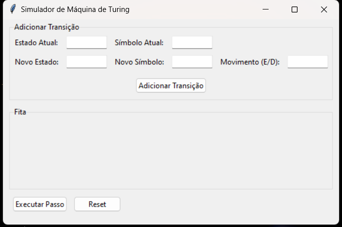
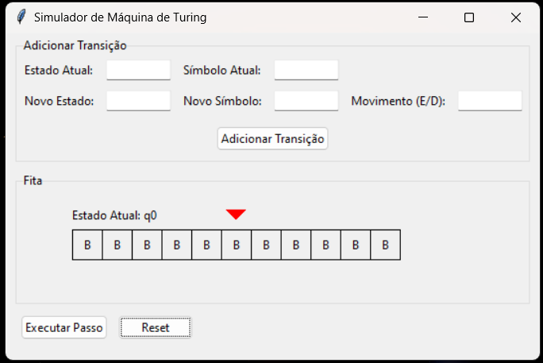

# Simulador de Máquina de Turing

Este repositório contém um **Simulador de Máquina de Turing** desenvolvido em Python, utilizando a biblioteca `tkinter` para a interface gráfica. O simulador permite criar e testar Máquinas de Turing de forma interativa, visualizando o funcionamento das transições e a manipulação da fita em tempo real.

---

## 🛠️ Funcionalidades
- Adicionar transições de estados de forma dinâmica.
- Visualizar a fita com destaque para a posição da cabeça de leitura/escrita.
- Executar passo a passo a simulação da máquina.
- Reiniciar a máquina para novas configurações de transições e estados.
- Interface gráfica intuitiva e fácil de usar.

---

## 📋 Como Usar
1. **Adicionar Transições**:
   - Insira os parâmetros da transição, como estado atual, símbolo atual, novo estado, novo símbolo e o movimento (E/D).
   - Clique em **Adicionar Transição** para salvar.

2. **Executar a Máquina**:
   - Clique em **Executar Passo** para processar uma transição por vez.
   - O estado atual e a posição da cabeça serão atualizados na interface.

3. **Resetar**:
   - Clique em **Reset** para reiniciar a máquina, limpar a fita e começar uma nova configuração.

---

## 💻 Requisitos
- Python 3.x
- Biblioteca `tkinter` (geralmente já incluída em instalações padrão do Python)

---

## 🚀 Como Executar
1. Clone o repositório:
   ```bash
   git clone https://github.com/seu-usuario/simulador-maquina-de-turing.git

2. Navegue até o diretório do projeto:
   ```bash
   cd simulador-maquina-de-turing

3. Execute o arquivo principal:
   ```bash
   python simulador.py

## 🧪 Exemplo de Configuração

Adicione as seguintes transições para criar uma máquina que escreve "1" na fita inicial:

### **Transição 1**
- **Estado Atual**: `q0`
- **Símbolo Atual**: `B`
- **Novo Estado**: `q1`
- **Novo Símbolo**: `1`
- **Movimento**: `D`

### **Transição 2**
- **Estado Atual**: `q1`
- **Símbolo Atual**: `B`
- **Novo Estado**: `qf`
- **Novo Símbolo**: `0`
- **Movimento**: `E`

Clique em **Executar Passo** para observar a fita sendo modificada.

---

## 🖼️ Captura de Tela




---

## 📄 Licença

Este projeto está licenciado sob a [MIT License](LICENSE).


